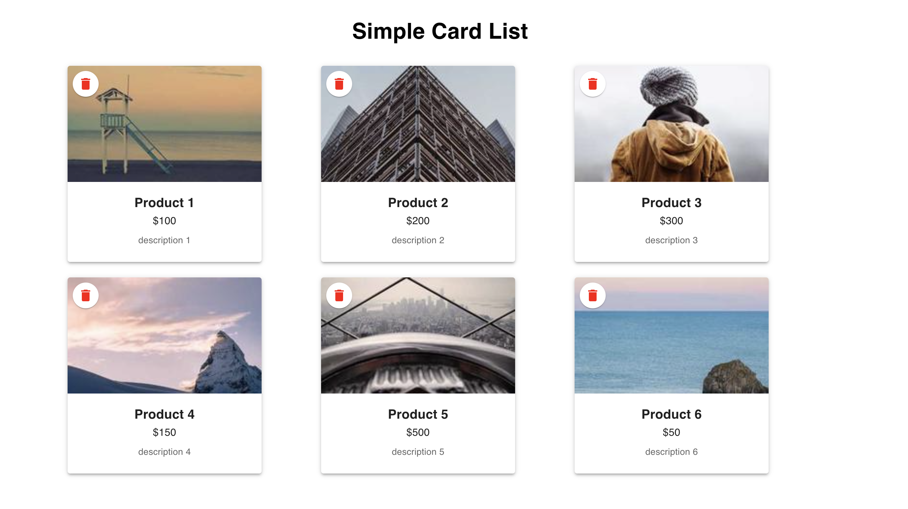

# Simple Card List Application

This project is a **Simple Card List Application** that consists of a frontend and backend. The frontend displays a list of products in a card format, while the backend serves product data and supports deletion functionality. The application uses **React** for the frontend, **Express** for the backend, and **Material-UI** for styling.

---

## Usage

- **Access the Application**: Go to `http://localhost:3001` in your browser.
- **View Products**: The product cards display the product information fetched from the backend.
- **Delete a Product**: Click the delete icon on a card to remove the product from both frontend and backend.

### Application Interface

The following image shows the interface of the Simple Card List Application:



In this interface:
- Each card displays the **product name**, **price**, and **description**.
- A randomly fetched **product image** is displayed at the top of each card.
- The **delete icon** is positioned in the top-left corner of each image. Clicking it removes the product from the list.
- The application title, **"Simple Card List"**, is prominently displayed at the top of the page.

The cards are arranged responsively, wrapping to the next line when there isn’t enough horizontal space. This ensures a consistent and visually pleasing layout across different screen sizes.

---

## Prerequisites

Before starting, ensure you have the following installed:
- **Node.js** (v14 or later recommended)
- **npm** (Node Package Manager)
- **Git** (for version control)

---

## Getting Started

### Step 1: Clone the Repository

First, clone the repository to your local machine:

```bash
git clone <your-repository-url>
cd simple-card-list-application
```

naviage to the web-dev folder:
```bash
cd StarterCode
```

### Step 2: Backend Setup

1. Navigate to the backend directory:
```bash
cd backend
```


2. Install dependencies:
```bash
npm install
```

3. Set up CORS for backend:

To allow requests from the frontend, we added CORS handling in `index.js`:
```bash
const cors = require('cors');
app.use(cors());
```

4. Start the backend server:
```bash
node index.js
```

The backend server will run at `http://localhost:3000` by default.

### Step 3: Frontend Setup

1. Open a new terminal window and navigate to the frontend directory:
```bash
cd frontend
```

2. Create a `.env.local` file in the frontend directory to specify the backend URL. Add the following line:
```bash
REACT_APP_API_BASE_URL= http://localhost:3000
```

3. Install frontend dependencies:
```bash
npm install
```

4. Start the frontend server:
```bash
npm start
```

The frontend server will run at `http://localhost:3001` by default.


### Step 4: Access the Application
- Open your browser and go to `http://localhost:3001` to view the application.
- The frontend will fetch product data from the backend and display it in a card layout.
- You can delete a product by clicking the delete icon on the card. This will remove the product from both the frontend view and the backend data.


### Additional Notes
- To stop the servers, press `Ctrl + C` in each terminal where the backend and frontend servers are running.
- Ensure that the backend server is running before launching the frontend to avoid data fetching issues.


# Functional Requirements Explianation (60 points)
## 1. Frontend Product List Display (30 points)
### **The frontend should fetch a list of products from the backend and display them in a card format using the Material UI card component. (10 points)**
I implemented the `ProductList` component in the frontend using Material UI's `Card` component to structure each product's display. This component fetches data from the backend using Axios and dynamically displays each product in a visually consistent card format.
### **Each card should include (10 points):**
- **Product name**
- **Product description**
- **Product price**
- **Product image**
- Each card displays the product’s name, description, price, and image by mapping through the products array received from the backend API. We used Material UI’s `CardMedia`, `CardContent`, and `Typography` components to style and format each attribute as required.
### Each card should have a delete icon button for product removal from the list, and when the button is clicked, the card should be removed from the frontend. (10 points)

- We added a delete button using Material UI’s `IconButton` component with a `DeleteIcon`. The `handleDelete` function is triggered on clicking this button, which calls the delete endpoint on the backend. Upon successful deletion, the product is removed from the local products state to instantly reflect the change in the frontend UI.
- 
## 2. Backend Get / Delete Product (30 points)
### The products are fetched from the backend using an API. (15 points)

- We created a `GET /api/products` endpoint in the backend, which responds with a list of products in JSON format. Each product includes a randomly generated image URL, along with name, description, and price fields. The frontend fetches this data upon loading, ensuring it dynamically receives the latest list of products.
### When a product is deleted, it should be removed from the backend data. (15 points)

- We implemented a `DELETE /api/products/:id` endpoint in the backend to handle product deletion. When the delete icon is clicked on a product card, the frontend sends a `DELETE` request with the product’s ID. The backend then removes the product from its internal data and returns a status to confirm deletion, which the frontend uses to update its display accordingly.
# Additional Requirements (40 points)
## 1. Frontend (30 points)
### Ensure the frontend is responsive, with product cards wrapping appropriately when there isn't enough space. (10 points)

- We used CSS flexbox properties to make the card container responsive. The cards wrap automatically when there’s not enough space, ensuring the layout adjusts to different screen sizes.
### The container holding cards should be always centered on the screen. (10 points)

- We styled the container to center itself horizontally and vertically using `justify-content: center` and `align-items: center`. This keeps the cards centered regardless of screen size, enhancing the UI experience.
### Ensure that product information persists and is fetched from the backend upon page refresh, avoiding hard-coded data in the frontend. (10 points)

- The frontend fetches product data from the backend API each time the page is loaded or refreshed. This approach ensures that the displayed product list is always up-to-date with the backend data, without any hard-coded product data in the frontend code.
## 2. Backend (10 points)
### Implement proper CORS handling to facilitate seamless communication between the frontend and backend. (10 points)
- We added CORS handling to the backend using the `cors` middleware in Express. This allows the frontend to make cross-origin requests to the backend, enabling seamless data exchange between the two components.
# Backend Endpoints Information
## 1. `GET /api/products`
### Fetches the list of products.
### Each product includes:
- A unique ID.
- Product name, description, and price.
- A randomly fetched image URL from Picsum to provide a unique image for each product card.
## 2. `DELETE /api/products/`
- Deletes a product by its ID.
- This endpoint removes a specified product from the backend data, updating the displayed product list in the frontend after a successful deletion.
